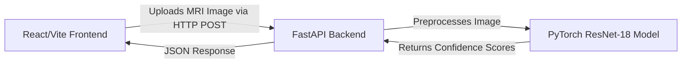

<div align="center">
  
  # 🧠 NeuroScan
  **An Advanced Brain Tumor MRI Classification Dashboard powered by Deep Learning**

  [](https://pytorch.org/)
  [](https://fastapi.tiangolo.com/)
  [](https://reactjs.org/)
  [](https://vitejs.dev/)

</div>

---

## 🚀 Overview

NeuroScan is an end-to-end Machine Learning web application designed to assist in the diagnosis of brain tumors from MRI scans. Utilizing **Transfer Learning** on a state-of-the-art **ResNet-18** deep convolutional neural network, the model classifies MRI scans into four categories with **>90% validation accuracy**:
- **Glioma**
- **Meningioma**
- **Pituitary Tumor**
- **No Tumor**

This project demonstrates a complete, production-ready AI pipeline: from data ingestion and deep learning model training (in Google Colab) to backend API deployment and a stunning, data-rich React frontend.

---

## ✨ Features

- **High-Accuracy ML Model**: Fine-tuned PyTorch ResNet-18 model utilizing advanced learning rate scheduling and weight decay.
- **Lightning-fast API**: A RESTful Python backend built with FastAPI that loads the PyTorch tensors directly into memory for near-instant inference.
- **Premium Dashboard UI**: A breathtaking, responsive React frontend built with Vite. Features dark mode, glassmorphism aesthetics, drag-and-drop file uploads, and a dynamic confidence probability distribution panel.
- **Jupyter/Colab Integration**: Includes a fully automated Google Colab notebook (`Colab_Training_and_Evaluation.ipynb`) for 1-click model training, evaluation, and confusion matrix generation on a free T4 GPU.

---

## 🏗️ Architecture



---

## 💻 Quick Start (Run Locally)

### 1. Start the FastAPI Backend
```bash
cd backend
python3 -m venv venv
source venv/bin/activate
pip install -r requirements.txt
uvicorn main:app --reload
```
*The backend will be live at `http://localhost:8000`*

### 2. Start the React Frontend
Open a new terminal window:
```bash
cd frontend
npm install
npm run dev
```
*The beautiful UI will be live at `http://localhost:5173`*

---

## 🔬 Model Training

If you wish to train the model yourself or view the evaluation metrics (Classification Report, Confusion Matrix), simply open the included Colab notebook:

[](https://colab.research.google.com/github/AnirudraKayal/MLP1/blob/main/Colab_Training_and_Evaluation.ipynb)

---

<div align="center">
  <b>Built for clinical speed. Designed for human precision.</b>
</div>
